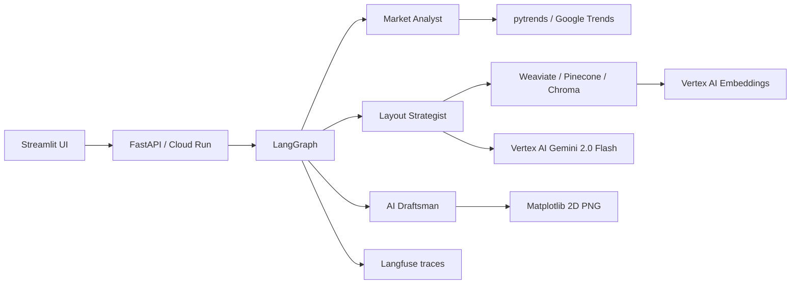

# Shashwat Capstone Retail — Adaptive Retail Layout Design

AI co-pilot for **Blue Retail Ventures**: generates compliant, locally-adapted conceptual store layouts using a **LangGraph** multi-agent pipeline on **GCP Vertex AI**.

## Architecture



| Agent | Role |
|-------|------|
| **Market Analyst** | Local product trends via `pytrends` (India / Gujarat proxy for Surat) |
| **Layout Strategist** | RAG over brand book, fixtures, NBC code, leasing, best practices → JSON layout |
| **AI Draftsman** | Renders zones and fixtures to a 2D PNG |

## Quick start (local, mock mode)

No GCP credentials required for first run:

```powershell
cd shashwat-capstone-retail
python -m venv .venv
.\.venv\Scripts\Activate.ps1
pip install -r requirements.txt
copy .env.example .env

$env:PYTHONPATH = (Get-Location)
$env:RESOURCES_DIR = "..\Resources"
$env:MOCK_LLM = "true"
$env:MOCK_TRENDS = "true"
$env:VECTOR_DB_PROVIDER = "chroma"

python scripts/ingest_documents.py
python -m uvicorn src.api.main:app --host 0.0.0.0 --port 8080
```

Streamlit (second terminal):

```powershell
$env:CLOUD_RUN_API_URL = "http://localhost:8080"
streamlit run streamlit_app/app.py
```

Or use `deploy\deploy-local.ps1`.

## API

- `GET /health` — service and index status
- `POST /generate_layout` — run full pipeline

```json
{
  "city": "Surat",
  "store_name": "Blue Retail Surat",
  "floor_area_sqm": 120,
  "keywords": ["iPhone 15", "gaming laptop"],
  "geo": "IN",
  "sub_geo": "IN-GJ"
}
```

## Production (GCP)

See [docs/DEPLOYMENT.md](docs/DEPLOYMENT.md).

**Access you will need:**

| Resource | Purpose |
|----------|---------|
| GCP project + billing | Vertex AI, Cloud Run, Artifact Registry |
| Service account | `Vertex AI User`, `Cloud Run Admin`, Secret Manager |
| Weaviate Cloud **or** Pinecone | Production vector DB (or Chroma for PoC only) |
| Langfuse account (optional) | Traces for RAG + LLM calls |
| Google Trends | Public via `pytrends` (rate limits apply) |

## Project layout

```
shashwat-capstone-retail/
├── src/agents/          # LangGraph nodes
├── src/rag/             # Ingestion + retrieval
├── src/api/             # FastAPI
├── prompts/             # Versioned prompts (separate Git repo ready)
├── scripts/             # ingest_documents.py
├── streamlit_app/       # Architect UI
├── deploy/              # gcloud scripts
├── docs/                # Architecture, deployment, user guide
└── Dockerfile
```

## Data

RAG documents live in `../Resources/` (provided with the capstone):

- `Blue_Retail_Brand_Book_v4.pdf`
- `Fixture_Catalog_Q3_2025.pdf`
- `National_Building_Code_Accessibility_Chapter.txt`
- `Store_Leasing_Agreement_Surat.pdf`
- `Retail_Design_Best_Practices.md.txt`

For Docker builds, copy `Resources` to `data/Resources/`.

## License

Capstone educational project — Blue Retail Ventures scenario.
