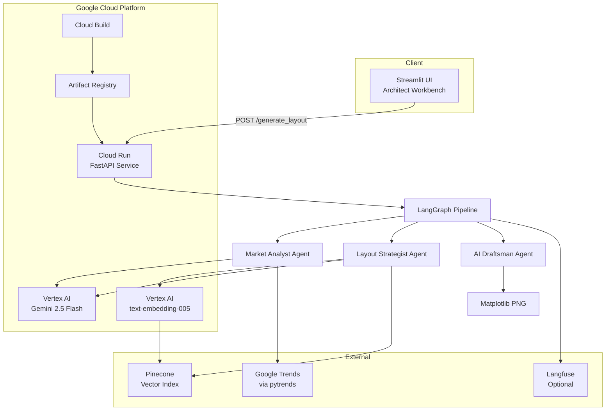
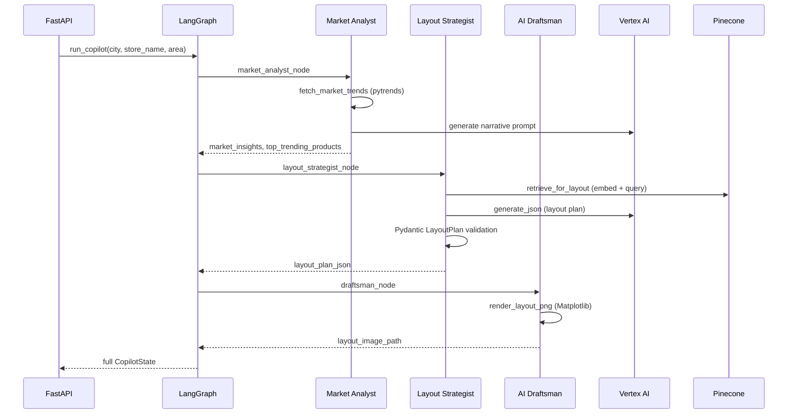

# Technical Design Document
## Shashwat Capstone Retail — Architect Copilot for Adaptive Retail Layout Design

**Project:** GCP Capstone Project 2  
**Client scenario:** Blue Retail Ventures  
**Author:** Shashwat Gupta  
**Version:** 1.0  
**Last updated:** May 2026

---

## 1. Executive Summary

The **Architect Copilot** is an AI-powered co-pilot that helps retail architects generate **conceptual store layouts** in minutes instead of weeks. It combines live **Google Shopping trends**, **retrieval-augmented generation (RAG)** over official design documents, and **Vertex AI Gemini** reasoning inside a **LangGraph** multi-agent workflow. Outputs include a validated JSON layout plan and a 2D PNG floor diagram.

The system is designed for deployment on **Google Cloud Platform (GCP)** using **Cloud Run**, **Artifact Registry**, **Vertex AI**, and **Pinecone** as the production vector database.

---

## 2. Business Context & Objectives

### 2.1 Problem

Blue Retail Ventures is expanding into Tier-2 cities (e.g. Surat, Gujarat). Architects must balance:

- Brand standards (decompression zone, power wall, circulation loop)
- Regulatory compliance (NBC 2016 accessibility)
- Leasing constraints (Surat store agreement)
- Local market demand (trending electronics categories)

Manual layout design is slow and difficult to keep consistent across stores.

### 2.2 Solution Goals

| Goal | How the system addresses it |
|------|-----------------------------|
| Reduce design cycle time | Automated multi-agent pipeline from trends → JSON → PNG |
| Ground decisions in official docs | RAG over brand book, fixture catalog, NBC, leasing |
| Local adaptation | Google Trends via `pytrends` (India / Gujarat geo) |
| Auditability | Langfuse tracing (optional), structured JSON output |
| Cloud-native deployment | Docker + Cloud Run + managed Pinecone |

### 2.3 Out of Scope

- Construction-ready CAD/BIM drawings
- Inventory, margin, or financial optimization
- Real-time store operations integration

---

## 3. System Architecture

### 3.1 High-Level Architecture



### 3.2 Component Overview

| Layer | Technology | Responsibility |
|-------|------------|----------------|
| UI | Streamlit | Parameter input, layout preview, market narrative |
| API | FastAPI + Uvicorn | REST endpoints, CORS, error handling |
| Orchestration | LangGraph | Stateful multi-agent workflow |
| LLM | Vertex AI Gemini (`gemini-2.5-flash`) | Market narrative + layout JSON generation |
| Embeddings | Vertex AI (`text-embedding-005`, 768-dim) | Document and query vectors for RAG |
| Vector DB | Pinecone (production), Chroma (local dev) | Semantic search over design corpus |
| Trends | pytrends | Google Shopping interest by geo |
| Rendering | Matplotlib | Deterministic 2D zone/fixture diagram |
| Observability | Langfuse (optional) | Traces and spans per pipeline run |
| Deployment | Docker, Cloud Run, Cloud Build | Containerized serverless API |

### 3.3 Repository Structure

```
shashwat-capstone-retail/
├── src/
│   ├── agents/           # LangGraph nodes (market, strategist, draftsman)
│   ├── api/              # FastAPI application
│   ├── llm/              # Vertex AI client + mock fallbacks
│   ├── rag/              # Chunking, ingestion, retrieval, vector store
│   ├── schemas/          # Pydantic LayoutPlan validation
│   ├── observability/    # Langfuse tracer
│   ├── prompts/          # Safe prompt rendering utilities
│   └── tools/            # Google Trends integration
├── prompts/              # Versioned prompt templates (Git-managed)
├── scripts/              # ingest_documents.py
├── streamlit_app/        # Architect UI
├── deploy/               # GCP setup and Cloud Run deploy scripts
├── docs/                 # This documentation set
├── Dockerfile
├── cloudbuild.yaml
└── requirements.txt
```

---

## 4. Multi-Agent Pipeline (LangGraph)

### 4.1 State Model

The shared state (`CopilotState`) flows through all agents:

| Field | Type | Description |
|-------|------|-------------|
| `city` | string | Target city (e.g. Surat) |
| `store_name` | string | Store identifier |
| `floor_area_sqm` | float | Total floor area |
| `keywords` | list[str] | Trend search terms |
| `geo` / `sub_geo` | string | Trends geography (IN / IN-GJ) |
| `market_insights` | dict | Raw trends + LLM narrative |
| `top_trending_products` | list[str] | Ranked products for layout |
| `retrieved_context` | list[dict] | RAG chunks with metadata |
| `layout_plan_json` | dict | Validated layout plan |
| `layout_plan_valid` | bool | Schema validation result |
| `layout_image_path` | string | Path to generated PNG |
| `trace_id` | string | Langfuse trace ID |
| `errors` | list[str] | Non-fatal warnings |

### 4.2 Agent Flow



### 4.3 Agent Details

#### Market Analyst

- **Input:** City, geo codes, optional keyword list
- **Tool:** `pytrends` with `gprop=froogle` (Google Shopping)
- **Logic:** Computes national + state-level interest; ranks products with weighted score (40% national, 60% state)
- **Output:** Trend data JSON + Gemini narrative summarizing placement recommendations
- **Fallback:** `MOCK_TRENDS=true` generates synthetic interest data when rate-limited

#### Layout Strategist

- **Input:** Market insights, RAG context, store parameters
- **Retrieval:** Multi-query RAG (layout rules, NBC, leasing, brand, fixtures)
- **Generation:** Gemini with `response_mime_type=application/json` for structured output
- **Validation:** Pydantic `LayoutPlan` schema (zones, fixtures, compliance checks)
- **Resilience:** Retries on parse failure; falls back to deterministic default layout rather than crashing

#### AI Draftsman

- **Input:** Validated JSON layout plan
- **Method:** Deterministic Python + Matplotlib (not LLM-generated graphics)
- **Output:** PNG with color-coded zones, fixture IDs, entrance marker
- **Rationale:** Ensures reproducible, inspectable floor diagrams

---

## 5. RAG Design

### 5.1 Document Corpus

Documents are stored in `../Resources/` (or `data/Resources/` in Docker):

| Document | Purpose |
|----------|---------|
| Blue Retail Brand Book | Decompression zone, power wall, circulation rules |
| Fixture Catalog Q3 2025 | Fixture IDs, dimensions, placement |
| NBC Accessibility Chapter | Circulation width, ramp slopes |
| Store Leasing Agreement (Surat) | Height, signage, prohibited uses |
| Retail Design Best Practices | General layout heuristics |

### 5.2 Ingestion Pipeline

1. Load PDF/TXT/MD files from `RESOURCES_DIR`
2. Split into chunks (`langchain-text-splitters`)
3. Embed with Vertex AI `text-embedding-005` (768 dimensions)
4. Upsert into vector store with metadata: `source_document`, `filename`, `chunk_index`

**Script:** `python scripts/ingest_documents.py`

### 5.3 Vector Store Abstraction

| Provider | Environment | Notes |
|----------|-------------|-------|
| `pinecone` | Production / Cloud Run | Serverless index, 768-dim cosine |
| `chroma` | Local Windows dev | Persistent local index |
| `weaviate` | Docker Compose option | Self-hosted alternative |

Production default: **Pinecone** index `retail-layout-rag` in `us-east-1`.

### 5.4 Retrieval Strategy

The retriever issues multiple semantic queries per layout request:

- Layout and circulation best practices
- NBC accessibility requirements
- Leasing constraints for the city
- Brand book rules
- Fixture catalog matches for trending products

Top-k chunks are formatted and injected into `prompts/layout_strategist_v1.txt`.

---

## 6. Data Models

### 6.1 Layout Plan Schema (excerpt)

```json
{
  "store_name": "Blue Retail Surat",
  "city": "Surat",
  "floor_area_sqm": 120.0,
  "entrance_side": "south",
  "zones": [
    {
      "zone_type": "decompression_zone",
      "name": "Welcome",
      "x_m": 0, "y_m": 0, "width_m": 4, "depth_m": 4,
      "priority_products": [],
      "compliance_notes": ["Uncluttered per brand book"]
    }
  ],
  "fixtures": [
    {
      "fixture_id": "BRV-FX-HP03",
      "fixture_name": "Hero Product Pedestal",
      "x_m": 5, "y_m": 1, "width_m": 1.2, "depth_m": 1.2,
      "rotation_deg": 0, "notes": "Headphones hero"
    }
  ],
  "trending_products": ["noise cancelling headphones"],
  "design_rationale": "…",
  "compliance_checks": [
    {
      "source_document": "National_Building_Code_Accessibility_Chapter.txt",
      "requirement": "Circulation width",
      "status": "pass",
      "detail": "Main path 2000mm specified"
    }
  ]
}
```

### 6.2 Zone Types

`decompression_zone`, `power_wall`, `circulation_path`, `merchandising`, `experience_zone`, `checkout`, `service_desk`, `bopis_pickup`, `storage`

---

## 7. API Design

### 7.1 Endpoints

| Method | Path | Description |
|--------|------|-------------|
| GET | `/` | Service info |
| GET | `/health` | Status, vector DB provider, mock flags |
| POST | `/generate_layout` | Run full multi-agent pipeline |
| GET | `/docs` | OpenAPI (Swagger) UI |

### 7.2 Generate Layout Request

```json
{
  "city": "Surat",
  "store_name": "Blue Retail Surat",
  "floor_area_sqm": 120.0,
  "keywords": ["iPhone 15", "Samsung Galaxy S24", "noise cancelling headphones", "gaming laptop"],
  "geo": "IN",
  "sub_geo": "IN-GJ"
}
```

### 7.3 Generate Layout Response

| Field | Description |
|-------|-------------|
| `layout_plan` | Validated JSON layout |
| `layout_plan_valid` | Whether Gemini output passed schema validation |
| `layout_image_base64` | PNG encoded for UI display |
| `market_insights` | Trends data + narrative |
| `trace_id` | Langfuse trace (if enabled) |
| `errors` | Warnings (e.g. fallback layout used) |

---

## 8. Configuration & Environment

Key environment variables (see `.env.example`):

| Variable | Production value | Purpose |
|----------|------------------|---------|
| `GCP_PROJECT_ID` | `bdc-trainings` | Vertex AI project |
| `GCP_LOCATION` | `us-central1` | Vertex region |
| `VERTEX_GEMINI_MODEL` | `gemini-2.5-flash` | LLM model |
| `VERTEX_EMBEDDING_MODEL` | `text-embedding-005` | Embedding model |
| `EMBEDDING_DIMENSION` | `768` | Must match Pinecone index |
| `VECTOR_DB_PROVIDER` | `pinecone` | Vector store backend |
| `PINECONE_API_KEY` | (secret) | Pinecone authentication |
| `PINECONE_INDEX_NAME` | `retail-layout-rag` | Index name |
| `MOCK_LLM` | `false` | Use mock instead of Vertex |
| `MOCK_TRENDS` | `false` | Use mock trend data |
| `LANGFUSE_ENABLED` | `false` | Enable Langfuse tracing |

Cloud Run uses platform env vars (`K_SERVICE` set); local `.env` is not loaded inside the container.

---

## 9. Security Design

| Concern | Mitigation |
|---------|------------|
| API keys in images | `.env` excluded via `.dockerignore` / `.gcloudignore` |
| Gemini access | Cloud Run service account + `roles/aiplatform.user` |
| Pinecone key | Injected at deploy time via `deploy/cloudrun-env.yaml` |
| Public API | Cloud Run `--allow-unauthenticated` for demo; restrict in production |
| Secrets | Optional Google Secret Manager integration |
| Prompt injection | RAG context treated as untrusted input; schema validation on output |

**Service account (default):** `{PROJECT_NUMBER}-compute@developer.gserviceaccount.com`

---

## 10. Observability

When `LANGFUSE_ENABLED=true`:

- One trace per `/generate_layout` request
- Spans: `market_analyst`, `rag_retrieval`, `layout_strategist`, `draftsman`
- Inputs/outputs logged for debugging and capstone demonstration

Langfuse SDK v3 is supported via `src/observability/langfuse_tracer.py`.

---

## 11. Non-Functional Requirements

| Requirement | Target |
|-------------|--------|
| API latency | ≤ 300s (Cloud Run timeout) |
| Memory | 2 GiB Cloud Run instance |
| CPU | 2 vCPU |
| Availability | Cloud Run auto-scaling (stateless) |
| Scalability | Horizontal via Cloud Run concurrency |
| Resilience | Mock fallbacks, JSON retry, default layout fallback |

---

## 12. Technology Stack Summary

| Category | Choice |
|----------|--------|
| Cloud | Google Cloud Platform |
| Compute | Cloud Run |
| CI/CD | Cloud Build + Artifact Registry |
| LLM | Vertex AI Gemini 2.5 Flash |
| Embeddings | Vertex AI text-embedding-005 |
| Orchestration | LangGraph |
| Vector DB | Pinecone |
| API | FastAPI |
| UI | Streamlit |
| Observability | Langfuse |
| Language | Python 3.11 |

---

## 13. Future Enhancements

1. **Google ADK** port for Agent Builder integration
2. **Human-in-the-loop** approval before layout finalization
3. **3D visualization** and CAD export (DXF/IFC)
4. **Scheduled re-ingestion** when brand book updates
5. **Private Cloud Run** with Identity-Aware Proxy for enterprise use
6. **MLflow** as alternative observability backend

---

## 14. References

- [Vertex AI Gemini model versions](https://cloud.google.com/vertex-ai/generative-ai/docs/learn/model-versions)
- [LangGraph documentation](https://langchain-ai.github.io/langgraph/)
- [Pinecone Python SDK](https://github.com/pinecone-io/pinecone-python-client)
- Capstone specification: `project_spec.txt`
